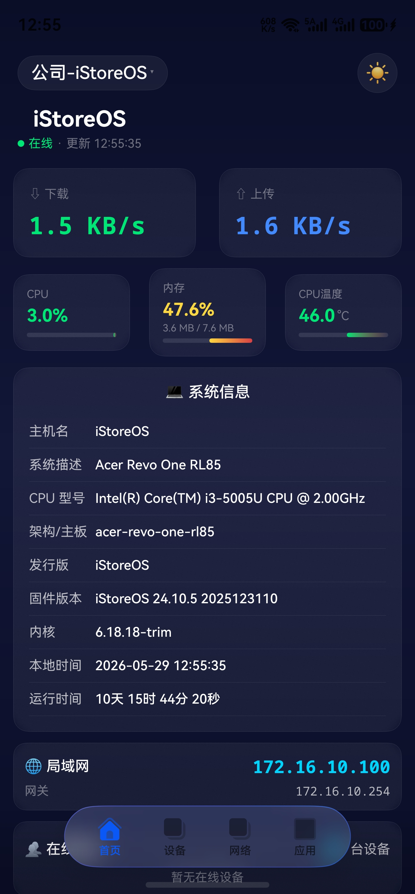
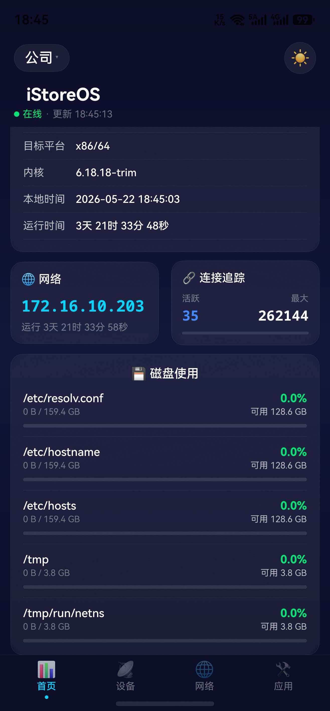
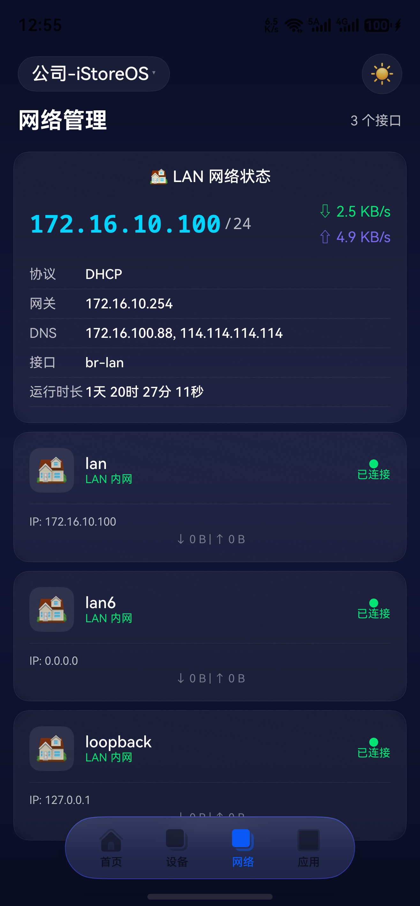
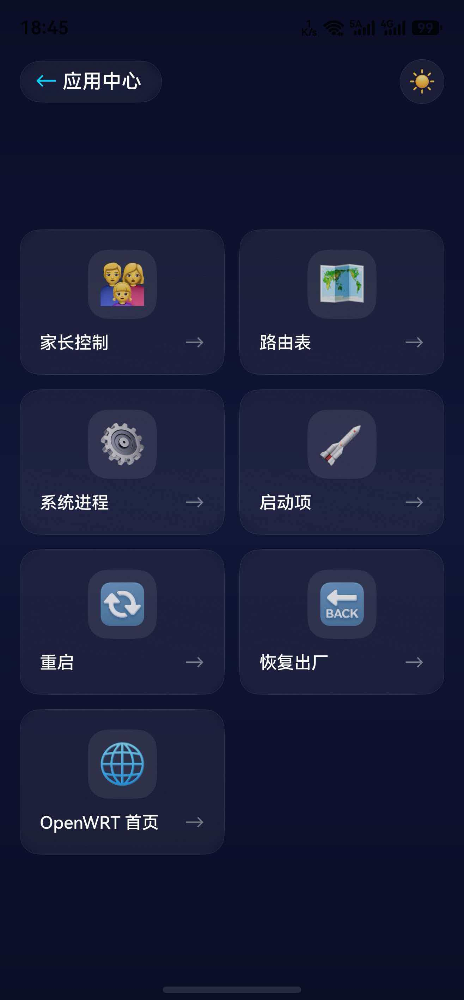

# iStore

iStore 是一款基于 **HarmonyOS 6.1.0** 开发的路由器管理应用，支持管理 OpenWrt 系列路由器设备。

## 功能特性

### 界面预览

| 系统监控                          | 磁盘管理                     |
| :---------------------------- | :----------------------- |
|  |  |

| 网络管理                        | 应用中心                     |
| :-------------------------- | :----------------------- |
|  |  |

## 支持的设备

- **OpenWrt** - 完全支持（通过 router-api）
- **iStoreOS** - 完全支持（通过 router-api）
- **QWRT** - 支持（通过 router-api）
- **ImmortalWrt** - 支持（通过 router-api）
- **LEDE** - 支持（通过 router-api）

## API 脚本（router-api）

### 概述

`router-api` 是一个轻量级的 REST API 脚本，用于在路由器上提供 HTTP 接口，方便 iStore 应用获取系统信息。

### 安装方式

**在线一键安装（推荐）：**

```bash
# 自动检测系统并安装
wget -O- https://raw.githubusercontent.com/HWYWL/iStore/main/api/install.sh | sh
```

```text
root@iStoreOS:/www/cgi-bin# wget -O- https://raw.githubusercontent.com/HWYWL/iStore/main/api/install.sh | sh
--2026-05-28 10:55:29--  https://raw.githubusercontent.com/HWYWL/iStore/main/api/install.sh
Resolving raw.githubusercontent.com... 185.199.108.133
Connecting to raw.githubusercontent.com|185.199.108.133|:443... connected.
HTTP request sent, awaiting response... 200 OK
Length: 11242 (11K) [text/plain]
Saving to: 'STDOUT'

-                                                  100%[===============================================================================================================>]  10.98K  --.-KB/s    in 0.03s   


╔═══════════════════════════════╗
2026-05-28 10:55:31 (362 KB/s) - written to stdout [11242/11242]

║   router-api  一键安装程序    ║
║   适配所有 OpenWrt 衍生版     ║
╚═══════════════════════════════╝

[✓] 检测到系统: iStoreOS 24.10.6
[✓] 检测到 uhttpd
[i] 配置 uhttpd CGI 支持...
[✓] uhttpd CGI 配置完成
[i] 正在下载 router-api ...
[✓] 已安装到 /www/cgi-bin/router-api
[✓] Token 认证已启用

[i] ==============================
[i]  你的 API Token (请保管好):  
[i]  xxxxxxxxxxxxxxxxxxxxxxxxxxx
[i] ==============================

[i] 验证安装...
[✓] 安装验证成功！API 工作正常

==============================================
  router-api 安装完成！
==============================================

  API 地址: http://192.168.200.1/cgi-bin/router-api
  Token:    xxxxxxxxxxxxxxxxxxxxxxxxxxxxx

  快速测试:
    # 方式1: URL 参数传 Token（所有系统通用）
    curl 'http://192.168.200.1/cgi-bin/router-api?action=system_info&token=66cf8a89ae1c22aeaaf4ec7bc55bf2ad'

    # 方式2: Header 传 Token（需 uhttpd 支持）
    curl 'http://192.168.200.1/cgi-bin/router-api?action=system_info' -H 'X-Auth-Token: 66cf8a89ae1c22aeaaf4ec7bc55bf2ad'

  支持的操作:
    ping              - 健康检查（无需 Token）
    system_info       - 系统信息
    system_board      - 硬件型号
    network_interfaces - 网络接口
    network_wifi      - WiFi 状态
    network_devices   - 网络设备
    dhcp_leases       - DHCP 租约
    storage_info      - 存储信息
    memory_info       - 内存信息
    cpu_info          - CPU 信息
    processes         - 进程列表
    uci_get           - 读取 UCI 配置
    uci_get_all       - 读取全部 UCI 配置

  查看 Token: cat /etc/router-api-token
  卸载: wget -qO- https://raw.githubusercontent.com/HWYWL/iStore/main/api/uninstall.sh | sh

==============================================
[✓] 全部完成！
root@iStoreOS:/www/cgi-bin#
```

```
# 查看生成的token
cat /etc/router-api-token
```

**手动安装：**

```bash
# 1. 创建 CGI 目录
mkdir -p /www/cgi-bin

# 2. 下载 API 脚本
wget -O /www/cgi-bin/router-api https://raw.githubusercontent.com/HWYWL/iStore/main/api/router-api

# 3. 设置执行权限
chmod +x /www/cgi-bin/router-api

# 4. 配置 uhttpd CGI
uci set uhttpd.main.cgi_prefix=/cgi-bin
uci commit uhttpd
/etc/init.d/uhttpd restart

# 5. 生成认证 Token
echo "your_token_here" > /etc/router-api-token
chmod 600 /etc/router-api-token
```

### 卸载方式

**在线一键卸载：**

```bash
wget -qO- https://raw.githubusercontent.com/HWYWL/iStore/main/api/uninstall.sh | sh
```

**手动卸载：**

```bash
# 1. 删除 CGI 脚本
rm -f /www/cgi-bin/router-api

# 2. 删除 Token 文件
rm -f /etc/router-api-token

# 3. 清除 UCI 配置
uci -q delete router-api.config
uci commit router-api

# 4. 重启 uhttpd（可选）
/etc/init.d/uhttpd restart
```

### API 使用说明

#### 基础信息

- **API 地址**: `http://路由器IP/cgi-bin/router-api`
- **认证方式**: Token（URL 参数或 Header）

#### 认证方式

**方式 1: URL 参数传 Token**

```bash
curl 'http://192.168.1.1/cgi-bin/router-api?action=system_info&token=your_token'
```

**方式 2: Header 传 Token**

```bash
curl 'http://192.168.1.1/cgi-bin/router-api?action=system_info' \
  -H 'X-Auth-Token: your_token'
```

#### 支持的操作

| 操作                   | 描述                  | 是否需要认证 |
| -------------------- | ------------------- | ------ |
| `ping`               | 健康检查                | 否      |
| `system_info`        | 系统信息（主机名、内核、运行时间等）  | 是      |
| `system_board`       | 硬件型号信息              | 是      |
| `network_interfaces` | 网络接口列表              | 是      |
| `network_wifi`       | WiFi 状态             | 是      |
| `network_devices`    | 网络设备状态              | 是      |
| `dhcp_leases`        | DHCP 租约列表           | 是      |
| `storage_info`       | 存储挂载点信息             | 是      |
| `memory_info`        | 内存使用信息              | 是      |
| `cpu_info`           | CPU 使用信息            | 是      |
| `processes`          | 进程列表                | 是      |
| `uci_get`            | 读取 UCI 配置           | 是      |
| `uci_get_all`        | 读取全部 UCI 配置         | 是      |
| `login`              | 登录获取 Token（需要 LuCI） | 否      |

#### 响应格式

**成功响应：**

```json
{
  "code": 0,
  "data": {
    "hostname": "OpenWrt",
    "kernel": "6.1.xx",
    "uptime": 3600,
    "local_time": "2024-01-01 12:00:00"
  }
}
```

**错误响应：**

```json
{
  "code": 401,
  "msg": "authentication required"
}
```

#### 使用示例

```bash
# 健康检查（无需 Token）
curl 'http://192.168.1.1/cgi-bin/router-api?action=ping'

# 获取系统信息
curl 'http://192.168.1.1/cgi-bin/router-api?action=system_info&token=xxx'

# 获取网络接口
curl 'http://192.168.1.1/cgi-bin/router-api?action=network_interfaces&token=xxx'

# 获取 DHCP 租约
curl 'http://192.168.1.1/cgi-bin/router-api?action=dhcp_leases&token=xxx'

# 读取 UCI 配置
curl 'http://192.168.1.1/cgi-bin/router-api?action=uci_get&config=network&section=lan&option=ipaddr&token=xxx'
```

### 脚本位置

- **安装脚本**: [api/install.sh](file:///e:/code/iStore/api/install.sh)
- **卸载脚本**: [api/uninstall.sh](file:///e:/code/iStore/api/uninstall.sh)
- **API 脚本**: [api/router-api](file:///e:/code/iStore/api/router-api)

### 兼容性

| 系统          | 支持状态 | 说明              |
| ----------- | ---- | --------------- |
| OpenWrt     | ✅ 支持 | 需要安装 router-api |
| iStoreOS    | ✅ 支持 | 需要安装 router-api |
| QWRT        | ✅ 支持 | 需要安装 router-api |
| ImmortalWrt | ✅ 支持 | 需要安装 router-api |
| LEDE        | ✅ 支持 | 需要安装 router-api |

## 开发环境

### 要求

- **DevEco Studio**: 4.1 或更高版本
- **HarmonyOS SDK**: 6.1.0
- **Node.js**: 18.19.0 或更高版本

### 构建命令

```bash
# 编译 release 版本
hvigorw assembleHap --mode=release

# 编译 debug 版本
hvigorw assembleHap --mode=debug

# 清理构建
hvigorw clean
```

### 运行项目

1. 打开 DevEco Studio
2. 导入项目：`File → Open → 选择项目目录`
3. 配置签名证书：`File → Project Structure → Signing Configs`
4. 运行：`Run → Run 'entry'` 或快捷键 `Shift+F10`

## 页面清单

| 模块   | 页面                  | 路径                                       |
| ---- | ------------------- | ---------------------------------------- |
| 入口   | LoginPage           | `pages/entry/LoginPage.ets`              |
| 仪表盘  | MainPage            | `pages/dashboard/MainPage.ets`           |
| 设备   | ClientDetailPage    | `pages/devices/ClientDetailPage.ets`     |
| 应用   | AppsPage            | `pages/apps/AppsPage.ets`                |
| 网络   | RouteTablePage      | `pages/network/RouteTablePage.ets`       |
| 家长控制 | ParentalControlPage | `pages/parental/ParentalControlPage.ets` |
| 进程   | ProcessListPage     | `pages/process/ProcessListPage.ets`      |
| 系统   | RebootPage          | `pages/system/RebootPage.ets`            |

## 状态管理

应用使用单例模式管理全局状态：

- **AppState**: 管理设备列表、连接状态、主题切换
- **DeviceStore**: 封装设备持久化逻辑（使用 preferences 存储）

## 主题系统

- 支持深色/浅色双主题
- 主题切换自动刷新所有监听组件
- 主题偏好持久化到 preferences

## 许可证

MIT License

## 贡献

欢迎提交 Issue 和 Pull Request！
